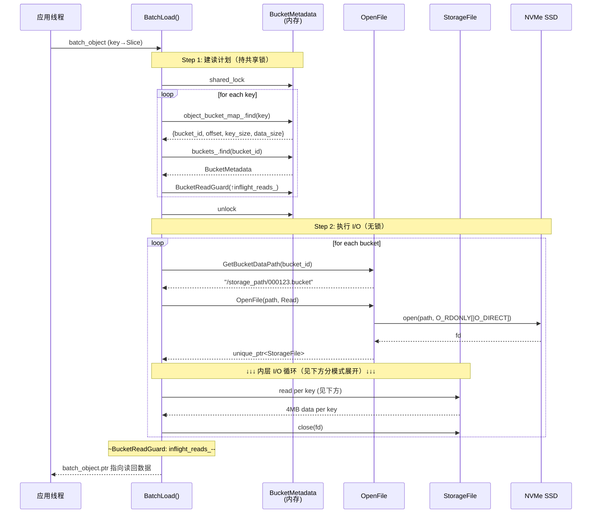
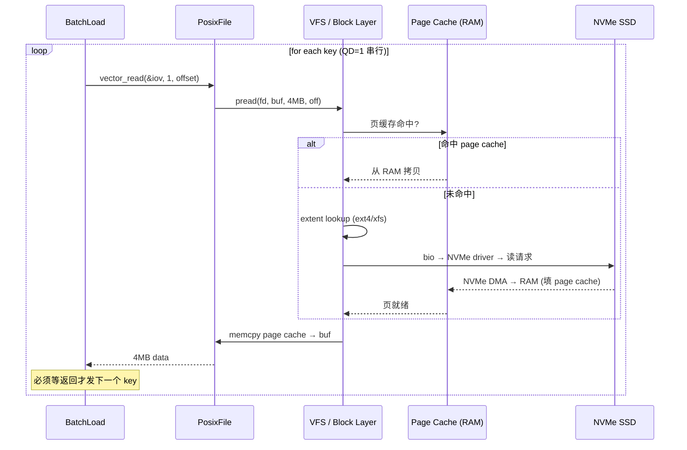
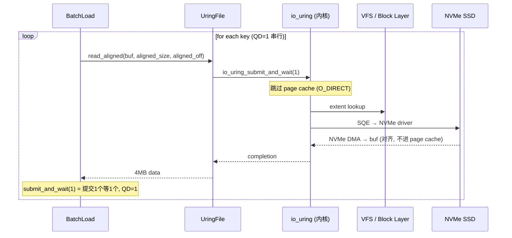
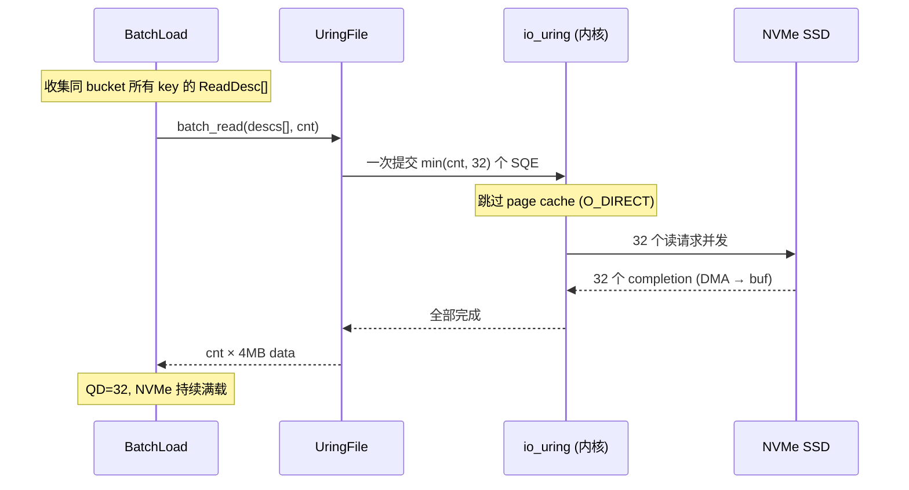
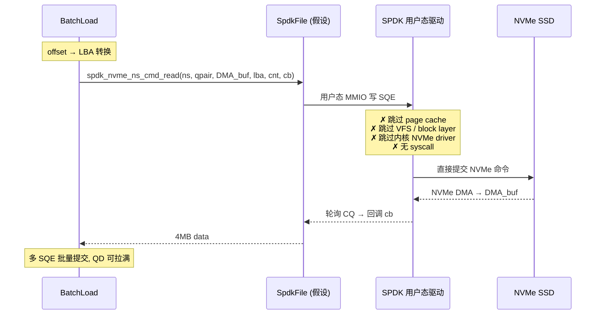

# BatchLoad 读路径性能分析：pread / io_uring / SPDK

- Date: 2026-07-02
- Branch: `supercache_ssd_load_test`
- Status: Analysis

## 1. 背景

Mooncake Store 的 SSD offload 层通过 `BatchLoad` 把 SSD 上的 KV-cache 数据读回内存。
当前读路径支持两种 I/O 模式，本文分析 `pread`（buffered）、`io_uring`（O_DIRECT）、
`SPDK`（未实现，对比）三种技术对 `BatchLoad` 性能的影响，并给出理论带宽上限。

### 硬件基线

- 3 × NVMe SSD（PCIe4 x4）组成 RAID0，总容量 21TB
- 单盘顺序读 ~7 GB/s，RAID0 理论物理上限 ~21 GB/s
- 单盘顺序写 ~5-6 GB/s，RAID0 写上限 ~15-18 GB/s
- 数据集 20TB，4MB/key，随机读

## 2. BatchLoad 当前实现

入口：`BucketStorageBackend::BatchLoad`
（`mooncake-store/src/storage_backend.cpp:1377`）

### 2.1 代码路径

```
BatchLoad(batch_object)
  │
  ├─ Step 1: 建读计划（持共享锁）
  │    for each key in batch_object:
  │      object_bucket_map_.find(key) → {bucket_id, offset, key_size, data_size}
  │      buckets_.find(bucket_id) → BucketMetadata
  │      BucketReadGuard(↑inflight_reads_)   // RAII，防止读时删桶
  │      组装 ReadPlan，按 bucket_id 分组
  │    unlock
  │
  ├─ Step 2: 执行 I/O（无锁）
  │    for each bucket:
  │      OpenFile(path, Read)              // 每次 BatchLoad 都 open
  │      for each key in bucket:
  │        if UringFile:  read_aligned()   // O_DIRECT，QD=1（逐 key 串行）
  │        else:          vector_read()    // buffered pread，QD=1
  │      close(fd)
  │
  └─ ~BucketReadGuard: inflight_reads_--
```

### 2.2 关键实现事实

| 事实 | 位置 | 影响 |
|------|------|------|
| 每次 BatchLoad 对每个 bucket 调 `open()` | `storage_backend.cpp:1460` | syscall 开销 |
| io_uring 路径逐 key 调 `read_aligned`，内部 `submit_and_wait(1)` | `storage_backend.cpp:1491` | **QD=1，串行** |
| `batch_read`（一次提交多 SQE）已实现但未被 BatchLoad 调用 | `file_interface.h:218` | 性能改进点 |
| buffered 模式写填 page cache，读命中 page cache | `storage_backend.cpp:2069` | 热 key 读可 RAM 速度 |
| O_DIRECT 模式读写都绕过 page cache | `storage_backend.cpp:2517` | 无 cache 复用 |

## 3. 时序图

### 3.1 通用流程（三种模式共用）



### 3.2 模式 A：buffered pread（use_uring=false，默认）



### 3.3 模式 B：io_uring O_DIRECT（use_uring=true）



### 3.4 模式 B'：io_uring + batch_read（改进后）



### 3.5 模式 C：SPDK（未实现，对比）



## 4. 经过 Cache 层级对比

| Cache 层 | buffered pread | io_uring O_DIRECT | SPDK |
|----------|:---:|:---:|:---:|
| ① 应用层 buffer pool | ✅ | ✅ | ✅ |
| ② Linux page cache | ✅ 命中/填充 | ✗ 绕过 | ✗ 绕过 |
| ③ VFS inode/dentry cache | ✅ | ✅ | ✗ |
| ④ block layer readahead | ✅ | ✗ | ✗ |
| ⑤ NVMe controller DRAM | ✅ | ✅ | ✅ |
| ⑥ SSD NAND 内部 DRAM | ✅ | ✅ | ✅ |

## 5. 理论带宽上限对比

### 5.1 读（BatchLoad）

| 场景 | buffered pread (QD=1) | io_uring 现状 (QD=1) | io_uring+batch_read (QD=32) | SPDK (QD拉满) |
|------|---:|---:|---:|---:|
| **cold 读 (drop cache)** | 12-14 GB/s | 13-15 GB/s | 17-18 GB/s | 18-19 GB/s |
| **热 key 读 (命中 RAM)** | **50+ GB/s** | 13-15 GB/s | 17-18 GB/s | 18-19 GB/s |
| 物理上限 | — | — | ~21 GB/s | ~21 GB/s |

> **没有任何软件优化能突破 ~21 GB/s 的 PCIe 物理带宽**（除非命中 RAM cache）。

### 5.2 写（BatchOffload）

| 场景 | pwrite buffered | io_uring O_DIRECT | SPDK |
|------|---:|---:|---:|
| **写带宽** | 15-18 GB/s | 8-12 GB/s | 15-18 GB/s |
| 额外 datasync | ❌ 无（async writeback） | ✅ **每 bucket fsync** | ❌ 无（completion=持久） |
| 额外 memcpy | 无 | ✅ 聚合 iov 到对齐 buffer | 无 |

> io_uring O_DIRECT 写最慢，因为 `WriteBucket` 每个 bucket 调一次
> `datasync()`（`storage_backend.cpp:2054`），强制 flush NVMe cache，串行化拖累带宽。

## 6. 关键分析

### 6.1 batch_read 不可能超过物理带宽

接入 `batch_read` 把 QD 从 1 拉到 32，冷读从 ~13 GB/s 提到 ~17-18 GB/s。
增益约 20-30%，来源是**提高 NVMe 利用率**，不是突破物理带宽。
天花板仍是 ~21 GB/s（PCIe4 ×3）。

### 6.2 23 GB/s 是 page cache 虚高

之前测试出现的 23 GB/s > 21 GB/s 物理上限，证明部分读命中了 page cache，
从 RAM 返回。`drop_cache` 后会回落到真实 SSD 带宽 ~13-15 GB/s。

### 6.3 page cache 复用只在 buffered 模式成立

| 路径组合 | 写填 cache? | 读用 cache? | 复用? |
|----------|:---:|:---:|:---:|
| pwrite + pread (buffered) | ✅ | ✅ | ✅ |
| O_DIRECT 写 + O_DIRECT 读 | ✗ | ✗ | ✗ |
| buffered 写 + O_DIRECT 读 | ✅ | ✗ | ✗ |
| O_DIRECT 写 + buffered 读 | ✗ | ✅ | ✗ |

### 6.4 SPDK 在大块场景增益有限

4MB 大块下 syscall/VFS/filesystem 相对开销占比小（单次 4MB 读里，几微秒
syscall <1%）。SPDK 的优势在小块（4K）高 IOPS 场景最明显——那才是 syscall /
page-cache 开销占比大的场景。

| 块大小 | SPDK vs io_uring 增益 |
|--------|:---:|
| 4MB（当前） | ~5-10% |
| 4K（小块） | 2-3 倍 |

## 7. 三种技术定位总结

| 维度 | buffered pread/pwrite | io_uring O_DIRECT | SPDK |
|------|---|---|---|
| **cold 读** | 12-14 GB/s | 13-18 GB/s | 18-19 GB/s |
| **热 key 读（命中 RAM）** | **50+ GB/s** | 13-18 GB/s | 18-19 GB/s |
| **cold 写** | 15-18 GB/s | 8-12 GB/s | 15-18 GB/s |
| **持久性** | 弱（未 flush 丢） | 强（per-bucket fsync） | 强（completion） |
| **page cache 复用** | ✅ | ✗ | ✗ |
| **syscall 开销** | 每次读 1 个 | 每次读 1 个 | 0 |
| **适用场景** | 写后即读热 key | 纯冷读 | 冷归档 / 小块高 IOPS |

### 核心洞察

1. **对 Mooncake KV-cache 场景**（offload 后短期 load 回热 key），page cache
   复用的收益（热 key 读 50+ GB/s）**远大于** SPDK 冷读的收益
  （18 vs 14 GB/s，多 ~4 GB/s）。

2. **buffered pread 默认是正确的**，因为 KV-cache offload 后大概率很快
   load 回来，page cache 是"免费的 RAM 加速层"。

3. **SPDK 只在以下场景有净收益**：
   - 冷数据为主（写完基本不读）
   - 4K 小块高 IOPS
   - 需要强持久性保证

4. **batch_read 是低投入高回报的改进**：把冷读从 QD=1 的 ~13 GB/s 拉到
   ~17 GB/s，1-2 天工作量，无需引入 SPDK。

## 8. 建议路线

| 优先级 | 改进 | 工作量 | 预期收益 |
|:---:|------|---|---|
| P0 | 接入 `batch_read`（QD 1→32） | 1-2 天 | cold 读 13→17 GB/s |
| P1 | OffsetAllocator backend 接 SPDK | ~1 周 | cold 读 17→18-19 GB/s |
| P2 | Bucket backend 接 SPDK | 2-3 周 | 风险高，收益有限 |

## 9. 参考代码位置

| 组件 | 文件 | 行号 |
|------|------|------|
| BatchLoad 入口 | `mooncake-store/src/storage_backend.cpp` | 1377 |
| 读计划构建 | 同上 | 1396-1445 |
| uring read_aligned 路径 | 同上 | 1473-1501 |
| pread fallback 路径 | 同上 | 1503-1507 |
| OpenFile 工厂 | 同上 | 2500-2534 |
| WriteBucket（datasync） | 同上 | 1989-2065 |
| UringFile::batch_read | `mooncake-store/include/file_interface.h` | 218 |
| SharedUringRing::batch_read | `mooncake-store/src/uring_file.cpp` | 143-173 |
| SpdkWrapper::SubmitRequest | `mooncake-store/src/spdk/spdk_wrapper.cpp` | 373-391 |
| StorageFile 抽象基类 | `mooncake-store/include/file_interface.h` | 57-157 |
